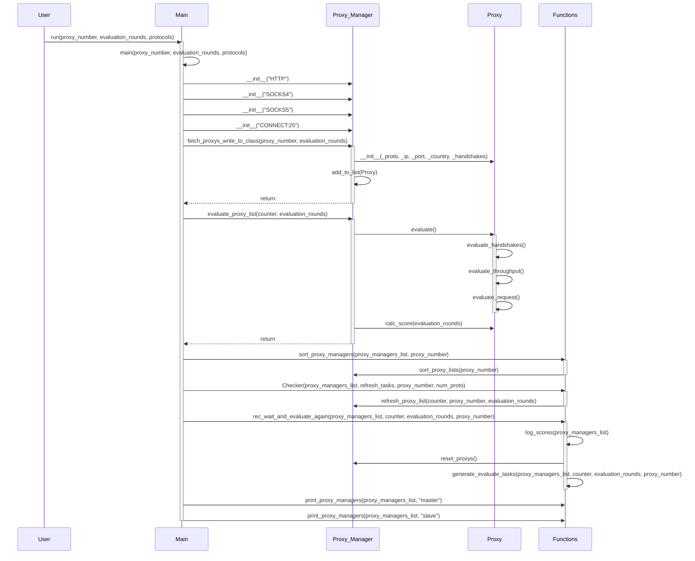

# Proxy Validation
 
Python Scripts are developed to create a dynamic data structure for managing open-source proxy servers using the Python module proxybroker2.
These scripts evaluate the proxy servers concurrently using asyncio, collecting data such as successful TCP-Handshake rate, average response time, average transmission time,  average throughput and perform a request. 
The goal is to evaluate a dynamic proxy list for reliable proxy connections.   
 
 

# Class Diagram
The portrayed Class Diagram for the Proxy Manager.  
 
 

# Sequence Diagram

