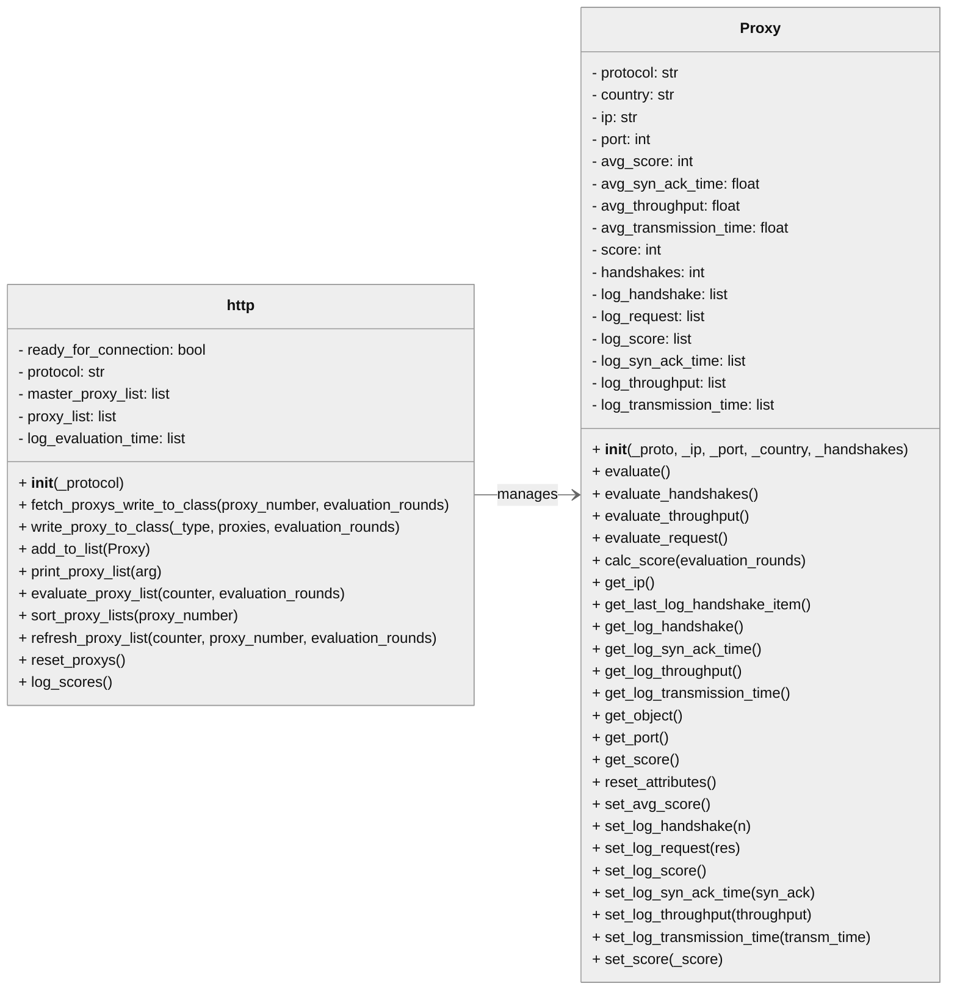

# Proxy Validation
<br>
Python Scripts are developed to create a dynamic data structure for managing open-source proxy servers using the Python module proxybroker2.
These scripts evaluate the proxy servers concurrently using asyncio, collecting data such as successful TCP-Handshake rate, average response time, average transmission time,  average throughput and perform a request. 
The goal is to evaluate a dynamic proxy list for reliable proxy connections.  <br>
<br>
<br>

# Class Diagram
The portrayed Class Diagram for the Proxy Manager. <br>
<br>
<br>



# Sequence Diagram

```mermaid 

sequenceDiagram
    actor main as "User/CLI - main"
    
    participant socks5 as "SOCKS5   :Proxy_Manager"
    participant http as "HTTP   :Proxy_Manager"
    participant broker as "Broker   :proxybroker"
    participant Proxy
    participant Functions

    
    main->>main: run(proxy_number: int, evaluation_rounds: int, protocols: set)
    main->>main: asyncio.get_event_loop()
    loop
      activate main
      main->>main: loop.run_until_complete(main(proxy_number, evaluation_rounds, protocols))
      
      
      main->>+http: new   Proxy_Manager("HTTP")
      http-->> main: http
      main->>main: fetch_tasks.append(http.fetch_proxy_write_to_class(proxy_num,eval_rounds))
      main->>main: evaluate_tasks.append(http.evaluate_proxy_list(count,proxy_num,eval_rounds))
      main->>main: refresh_tasks.append(http.refresh_proxy_list(count,proxy_num,eval_rounds))

      main->>+socks5: new   Proxy_Manager("SOCKS5")
      socks5-->>main: socks5

      main->>main: fetch_tasks.append(socks5.fetch_proxy_write_to_class(proxy_num,eval_rounds))
      main->>main: evaluate_tasks.append(socks5.evaluate_proxy_list(count,proxy_num,eval_rounds))
      main->>main: refresh_tasks.append(socks5.refresh_proxy_list(count,proxy_num,eval_rounds))
      main
      par fetch http and extract fields to proxy class
          
        main->>http:fetch_proxys_write_to_class(proxy_number, evaluation_rounds)
        
        http->>Proxy: __init__(_proto, _ip, _port, _country, _handshakes)
        activate Proxy
        http->>http: add_to_list(Proxy)
        http-->>main: return
      end

      main->>http: asyncio.evaluate_proxy_list(counter, evaluation_rounds,proxy_number)
      
      http->>Proxy: asyncio.evaluate()
      Proxy->>Proxy: evaluate_handshakes()
      Proxy->>Proxy: evaluate_throughput()
      Proxy->>Proxy: evaluate_request()
      http->>Proxy: calc_score(evaluation_rounds)
      http-->>main: return
      

      main->>Functions: sort_https(https_list, proxy_number)
      activate Functions
      Functions->>http: sort_proxy_lists(proxy_number)
      deactivate Functions

      main->>Functions: Checker(https_list, refresh_tasks, proxy_number, num_proto)
      activate Functions
      Functions->>http: refresh_proxy_list(counter, proxy_number, evaluation_rounds)
      deactivate Functions

      main->>Functions: rec_wait_and_evaluate_again(https_list, counter, evaluation_rounds, proxy_number)
      activate Functions
      Functions->>Functions: log_scores(https_list)
      Functions->>http: reset_proxy_objects()
      http ->> Proxy: reset_proxys()
      Proxy--> http: return
      Functions->>Functions: generate_evaluate_tasks(https_list, counter, evaluation_rounds, proxy_number)
      deactivate Functions
      
      deactivate Proxy
      main->>Functions: print_https(https_list, "master")
      
      deactivate http
      deactivate socks5
      deactivate main
    end
```

